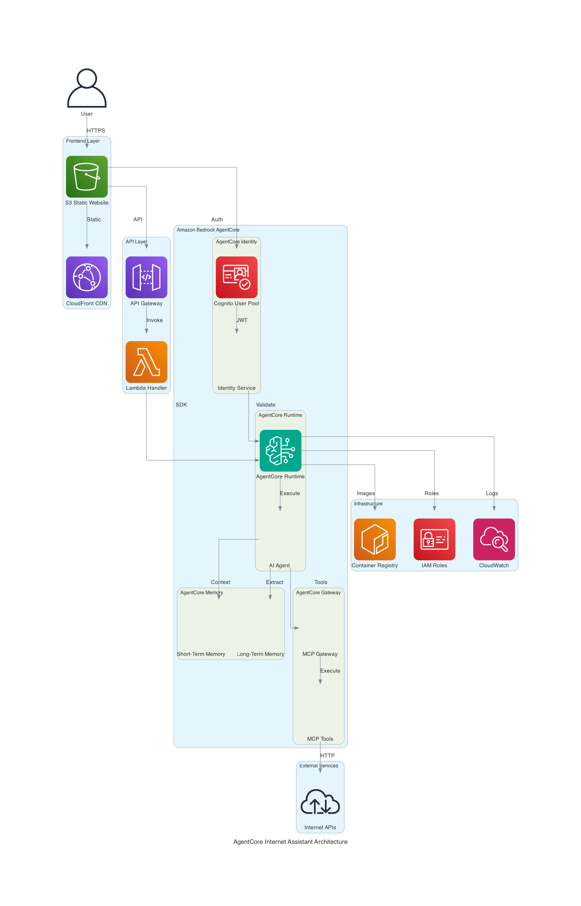

# AgentCore Internet Assistant 🤖

A production-ready AI assistant built with Amazon Bedrock AgentCore that can fetch internet data, remember conversations, and serve users through a web interface.



## 🚀 Features

- **AgentCore Runtime**: Serverless deployment with automatic scaling
- **AgentCore Memory**: Persistent conversation memory with user preferences extraction
- **AgentCore Gateway**: Secure MCP tools for internet data fetching
- **AgentCore Identity**: JWT-based authentication with Cognito
- **Web Frontend**: Responsive chat interface hosted on S3
- **API Integration**: RESTful API via Lambda and API Gateway

## 📋 Prerequisites

- AWS CLI configured (`aws configure`)
- Python 3.10+ with pip
- AgentCore CLI: `pip install bedrock-agentcore-cli`
- Access to Amazon Bedrock models (Claude 3.7 Sonnet)

## ⚡ Quick Start

### Option 1: Terraform Deployment (Recommended)
```bash
# Clone and deploy with Terraform
git clone https://github.com/catchmeraman/agentcore.git
cd agentcore
./deploy_terraform.sh
```

### Option 2: CloudFormation Deployment
```bash
# Clone and deploy with CloudFormation
git clone https://github.com/catchmeraman/agentcore.git
cd agentcore
./deploy_complete.sh
```

### Option 3: AWS MCP Integration (Comprehensive)
```bash
# Clone and deploy with specialized AWS MCP servers
git clone https://github.com/catchmeraman/agentcore.git
cd agentcore
./deploy_aws_mcp.sh
```

### Option 4: Official AWS MCP Integration (Recommended)
```bash
# Clone and deploy with official AWS MCP servers from AWS Labs
git clone https://github.com/catchmeraman/agentcore.git
cd agentcore
./deploy_official_aws_mcp.sh
```

All scripts will:
1. Install dependencies
2. Create AgentCore Memory resources
3. Deploy AWS infrastructure
4. Deploy AgentCore agent
5. Configure and upload frontend

## 🏗️ Architecture

The application uses a serverless architecture with the following components:

### Frontend Layer
- **S3 Static Website**: Hosts the chat interface
- **CloudFront CDN**: Global content delivery

### API Layer  
- **API Gateway**: RESTful API endpoints
- **Lambda**: Handles API requests and AgentCore integration

### AgentCore Services
- **Runtime**: Serverless agent execution environment
- **Memory**: STM/LTM with preference extraction
- **Gateway**: MCP tool discovery and execution
- **Identity**: JWT authentication and session management

### External Integration
- **Internet APIs**: Web search and URL fetching
- **Infrastructure**: ECR, IAM, CloudWatch for operations

## 🛠️ Manual Deployment

### Terraform Deployment

1. **Setup Memory**:
```bash
python setup_memory.py
export MEMORY_ID=<generated-memory-id>
```

2. **Deploy AgentCore Agent**:
```bash
agentcore configure -e agent.py
agentcore launch
```

3. **Deploy Infrastructure**:
```bash
cd terraform
terraform init
terraform plan -var="agent_arn=<your-agent-arn>"
terraform apply -var="agent_arn=<your-agent-arn>"
```

4. **Configure Frontend**:
```bash
API_ENDPOINT=$(terraform output -raw api_endpoint)
sed -i "s|YOUR_AGENTCORE_ENDPOINT|$API_ENDPOINT|g" ../frontend/index.html
aws s3 cp ../frontend/index.html s3://$(terraform output -raw s3_bucket_name)/
```

### CloudFormation Deployment

1. **Setup Memory**:
```bash
python setup_memory.py
export MEMORY_ID=<your-memory-id>
```

2. **Deploy Infrastructure**:
```bash
aws cloudformation deploy \
  --template-file infrastructure.yaml \
  --stack-name agentcore-internet-assistant \
  --capabilities CAPABILITY_IAM
```

3. **Deploy Agent**:
```bash
agentcore configure -e agent.py
agentcore launch
```

4. **Configure Frontend**:
```bash
# Update API endpoint in frontend
API_ENDPOINT=$(aws cloudformation describe-stacks --stack-name agentcore-internet-assistant --query 'Stacks[0].Outputs[?OutputKey==`ApiEndpoint`].OutputValue' --output text)
sed -i "s|YOUR_AGENTCORE_ENDPOINT|$API_ENDPOINT|g" frontend/index.html

# Upload to S3
BUCKET=$(aws cloudformation describe-stacks --stack-name agentcore-internet-assistant --query 'Stacks[0].Outputs[?OutputKey==`FrontendURL`].OutputValue' --output text | cut -d'/' -f3)
aws s3 cp frontend/index.html s3://$BUCKET/
```

## 🔧 Available MCP Tools

### Built-in Tools
| Tool | Description | Example |
|------|-------------|---------|
| `fetch_url_data(url)` | Fetch content from any URL | "Get data from https://api.github.com/users/octocat" |
| `search_web(query)` | Search web using DuckDuckGo | "Search for latest AWS news" |

### Extended MCP Integration
The project supports multiple MCP integration methods:

1. **Direct Integration**: Add tools directly to the agent (`agent_with_multiple_mcp.py`)
2. **AgentCore Gateway**: Connect to external MCP servers via Gateway (`agent_with_external_mcp.py`)
3. **AWS MCP Servers**: Specialized AWS operations (`agent_with_aws_mcp.py`)
4. **Official AWS MCP**: Official AWS Labs MCP servers (`agent_with_official_aws_mcp.py`) - **RECOMMENDED!**
5. **Local MCP Servers**: Run MCP servers locally for development (`docker-compose.yml`)

See [MCP Integration Guide](MCP_INTEGRATION_GUIDE.md), [AWS MCP Integration](AWS_MCP_INTEGRATION.md), and [Official AWS MCP Integration](OFFICIAL_AWS_MCP_INTEGRATION.md) for detailed instructions.

### Official AWS MCP Servers (Recommended)
- **🏗️ AWS CLI MCP**: Direct AWS CLI integration with all services
- **☁️ AWS CloudFormation MCP**: Stack management and template operations
- **🖥️ AWS EC2 MCP**: Instance and VPC management
- **🪣 AWS S3 MCP**: Bucket and object operations
- **⚡ AWS Lambda MCP**: Function management and deployment
- **🗄️ AWS RDS MCP**: Database management and monitoring
- **🔐 AWS IAM MCP**: Identity and access management
- **📊 AWS CloudWatch MCP**: Monitoring, logging, and metrics

### AWS MCP Servers Available
- **🏗️ AWS Diagram**: Generate architecture diagrams (`create_aws_diagram`, `create_serverless_diagram`)
- **⚙️ AWS EKS**: Manage EKS clusters (`list_eks_clusters`, `get_cluster_info`, `generate_eks_manifest`)
- **🔧 AWS Terraform**: Generate IaC (`generate_terraform_s3`, `generate_terraform_eks`, `terraform_plan`)
- **💰 AWS Cost**: Cost analysis (`get_monthly_costs`, `get_rightsizing_recommendations`, `analyze_cost_anomalies`)
- **🐙 GitHub**: Repository management (`list_repositories`, `get_file_content`, `search_repositories`)

### Additional Tool Categories Available
- **File System**: Read files, list directories, file operations
- **Database**: SQL queries, data operations  
- **System**: Safe command execution, system monitoring
- **Web Scraping**: Advanced web content extraction

## 💬 Example Queries

- "Fetch the latest commit from https://api.github.com/repos/aws/aws-cli/commits"
- "Search for Amazon Bedrock pricing information"
- "Get the content from https://aws.amazon.com/bedrock/"
- "What's the weather API data from OpenWeatherMap?"

## 🔒 Security Features

- **JWT Authentication**: Cognito-based user authentication
- **IAM Roles**: Least-privilege access controls
- **HTTPS Only**: Encrypted communication
- **Request Limits**: Timeout and size restrictions on external calls
- **Session Isolation**: Per-user memory and state management

## 📊 Monitoring

- **CloudWatch Logs**: Automatic logging for all components
- **AgentCore Observability**: Built-in request/response tracking
- **Performance Metrics**: Response times and error rates
- **Usage Analytics**: User interaction patterns

## 🧹 Cleanup

### Terraform Cleanup
```bash
cd terraform
./destroy.sh
# Manually delete AgentCore agent and memory resources
```

### CloudFormation Cleanup
```bash
# Delete CloudFormation stack
aws cloudformation delete-stack --stack-name agentcore-internet-assistant

# Delete AgentCore agent
agentcore delete <agent-name>

# Delete memory resources
python -c "from bedrock_agentcore.memory import MemoryClient; client = MemoryClient(); client.delete_memory('$MEMORY_ID')"
```

## 🔧 Customization

### Add New MCP Tools
```python
@mcp_server.tool()
def analyze_sentiment(text: str) -> str:
    """Analyze sentiment of text"""
    # Your implementation
    return result
```

### Extend Memory Strategies
```python
strategies=[
    {
        "customMemoryStrategy": {
            "name": "insights",
            "extraction_prompt": "Extract key insights"
        }
    }
]
```

### Modify Frontend
- Edit `frontend/index.html` for UI changes
- Add CSS styling and JavaScript features
- Integrate with additional APIs

## 📚 Complete Documentation

### 🚀 Quick Start
- **[COMPLETE_INTEGRATION_SUMMARY.md](COMPLETE_INTEGRATION_SUMMARY.md)** - Master guide with all 5 deployment options
- **[DEPLOYMENT_COMPARISON.md](DEPLOYMENT_COMPARISON.md)** - Detailed comparison to choose the right method

### 🔧 Technical Guides  
- **[DETAILED_DOCUMENTATION.md](DETAILED_DOCUMENTATION.md)** - Complete technical deep-dive
- **[PROJECT_STRUCTURE.md](PROJECT_STRUCTURE.md)** - Project organization and file structure

### 🤖 MCP Integration Guides
- **[MCP_INTEGRATION_GUIDE.md](MCP_INTEGRATION_GUIDE.md)** - General MCP integration methods
- **[AWS_MCP_INTEGRATION.md](AWS_MCP_INTEGRATION.md)** - Custom AWS MCP servers guide  
- **[OFFICIAL_AWS_MCP_INTEGRATION.md](OFFICIAL_AWS_MCP_INTEGRATION.md)** - Official AWS Labs MCP integration
- **[AGENTCORE_GATEWAY_MCP_INTEGRATION.md](AGENTCORE_GATEWAY_MCP_INTEGRATION.md)** - Enterprise Gateway integration

### 📖 Simple Explanations
- **[HOW_IT_WORKS_SIMPLE.md](HOW_IT_WORKS_SIMPLE.md)** - Layman's explanation of AgentCore + MCP
- **[VISUAL_FLOW_DIAGRAM.md](VISUAL_FLOW_DIAGRAM.md)** - Step-by-step visual flow diagrams

## 🤝 Contributing

1. Fork the repository
2. Create a feature branch (`git checkout -b feature/amazing-feature`)
3. Commit changes (`git commit -m 'Add amazing feature'`)
4. Push to branch (`git push origin feature/amazing-feature`)
5. Open a Pull Request

## 📄 License

This project is licensed under the MIT License - see the [LICENSE](LICENSE) file for details.

## 🆘 Support

- Create an issue for bugs or feature requests
- Check the [troubleshooting guide](DETAILED_DOCUMENTATION.md#troubleshooting-guide)
- Review AWS AgentCore documentation

## 🏷️ Tags

`aws` `bedrock` `agentcore` `ai` `mcp` `serverless` `python` `cloudformation` `lambda` `s3`
